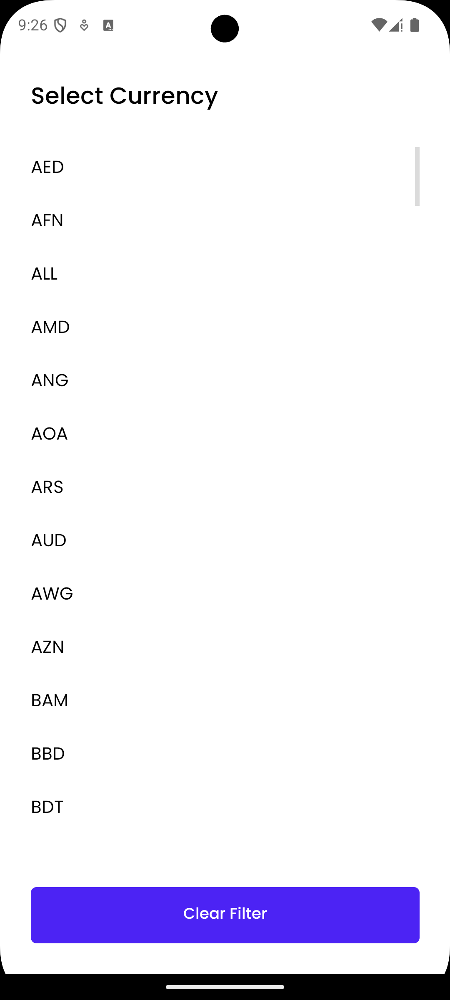
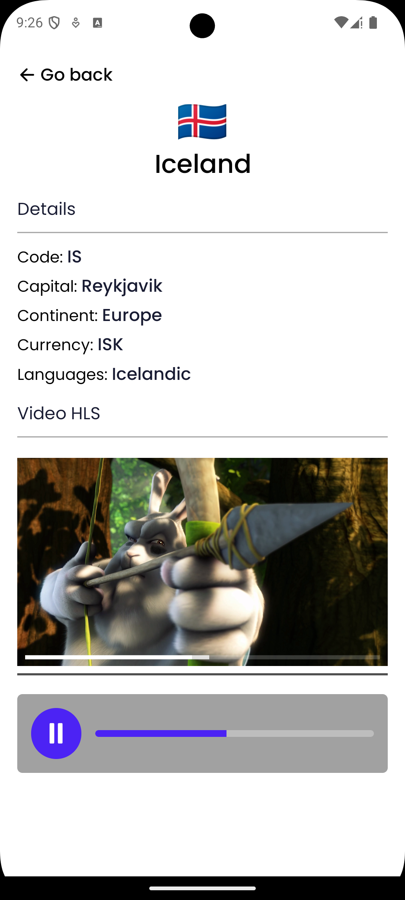

# Crehana Challenge

This project is a mobile application developed with React Native, Expo, NativeWind, and Apollo Client. The app allows users to explore a list of countries, apply filters, and view specific details of each country. Additionally, HLS is used for streaming video playback.

## How to run the project (developed for Android)

1. **Install dependencies**:
   ```bash
   npm install
   ```
2. **Start the development server**:
   ```bash
   npm run android
   ```

## Technologies Used

- **React Native**: Main framework for mobile development.
- **Expo**: Tool to simplify the development and execution of the app.
- **NativeWind**: Styling with Tailwind CSS classes.
- **Apollo Client**: GraphQL client for handling remote data.
- **i18next**: Internationalization to support multiple languages.

## Application Flow

1. **Loading Screen (`LoadingScreen`)**:

   - Displays while fonts and initial data are being loaded. Country data is fetched using GraphQL with Apollo Client.

2. **Country List (`CountryListScreen`)**:

   - Displays a list of countries with search and filter options by continent and currency.

3. **Country Details (`CountryDetailsScreen`)**:
   - Shows detailed information about a selected country along with an HLS video.

## Project Structure

### 1. `src`

The `src` folder contains all the source code for the application. The main subfolders are described below:

- **/components**: Reusable components used across the application.

  - `LoadingDots`: Loading dots animation.
  - `ScreenContainer`: Base container for screens with back navigation support.
  - `HlsVideoPlayer`: Component that handles HLS video playback, allowing live video streams to be played using a `.m3u8` URL. Includes playback controls such as play/pause and a progress bar (added to the native player).

- **/contexts**: Global contexts to handle shared state.

  - `countriesContext.tsx`: Provides a context to manage country data throughout the application. Allows quick access to countries, continents, and currencies.

- **/graphql**: Apollo Client setup and GraphQL queries/mutations.

  - `apolloClient.ts`: Configures the Apollo client to interact with the GraphQL API.
  - `queries.ts`: Contains the query to fetch the list of countries along with their details such as continent, language, currency, etc.

- **/hooks**: Custom hooks to handle reusable logic.

  - `useCountries.ts`: Hook to fetch country details from the context.
  - `useColors.ts`: Hook to manage dynamic colors based on the theme.
  - `useLocalization.ts`: Hook to manage the device's language.

- **/languages**: Internationalization (i18n) for supporting multiple languages.

  - `i18n.ts`: Configures i18next to handle translations.
  - `locales/`: Contains JSON files with translations for each language (e.g., `en.json`, `es.json`).

- **/navigation**: Navigation setup for the app.

  - `appNavigationContainer.tsx`: Defines the navigation container using `react-navigation` and a stack navigator.

- **/screens**: Main screens of the application.

  - `countryListScreen/`: Main screen displaying a list of countries with filters and search.
  - `countryDetailsScreen.tsx`: Screen showing the details of a selected country.
  - `loadingScreen.tsx`: Loading screen shown while the app is initializing.
  - `errorScreen.tsx`: Error screen shown when the list of countries cannot be retrieved.

- **/theme**: Theme-related configurations for the app.

  - `colors.ts`: Defines the colors used in the app.

- **/utils**: Helper functions and global types.

  - `helpers.ts`: Utility functions such as `convertToEmoji`.
  - `types.ts`: Defines TypeScript types used throughout the app, such as `RootStackParamList`.

- **/App.tsx**: Main file that loads custom fonts (Poppins light, regular, and medium), manages the app's preparation state, and renders content with ApolloProvider and CountriesProvider, in addition to setting up navigation and the status bar.

- **/tailwind.config.js**: Main file responsible for overriding the base theme of Tailwind.

### 2. Internationalization (i18n)

The app uses **i18next** to handle multiple languages.

**Configuration:**

- Main file: `i18n.ts`
- Supported languages:
  - `en.json`: Translations in English.
  - `es.json`: Translations in Spanish.

**Usage:**
To translate text in the app, use the `useTranslation` hook:

```tsx
import { useTranslation } from 'react-i18next';

const { t } = useTranslation();
```

### 3. Tailwind and NativeWind

The app uses **NativeWind** (an implementation of **Tailwind CSS** for React Native) to handle styles efficiently.

**Configuration:**

- Main file: `tailwind.config.js`
- Custom classes: Colors and fonts are extended in the Tailwind configuration.

**Example using Poppins:**

```tsx
<View className="flex-1 items-center justify-center">
  <Text className="font-poppins text-lg">Hello, World!</Text>
</View>
```

## Screenshots

[](https://drive.google.com/file/d/1QOujiwx0B6T7zFsgsJ37HDBdGxJ00e68/view?usp=sharing)





